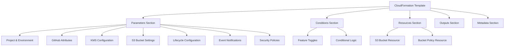
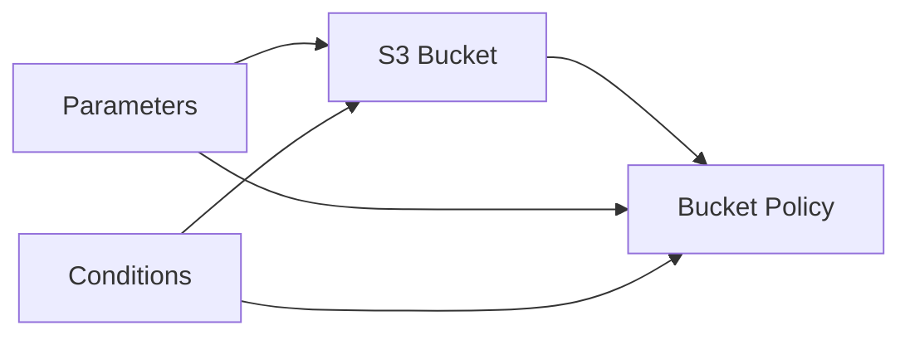

# Design Document

## Overview

The S3 bucket CloudFormation template is designed as a comprehensive, reusable nested stack component that provides extensive configuration options for S3 bucket deployment. The template follows AWS best practices for security, cost optimization, and operational excellence while maintaining flexibility for various use cases.

The design emphasizes modularity, security-first approach, and comprehensive parameter validation to ensure reliable deployments across different environments and projects.

## Architecture

### Template Structure



### Resource Dependencies



## Components and Interfaces

### 1. Parameter Groups

The template organizes parameters into logical groups for better user experience:

- **Project and Environment**: Core identification parameters
- **GitHub Attributes**: Source control and CI/CD integration
- **KMS Configuration**: Encryption settings
- **S3 Bucket Configuration**: Core bucket properties
- **Lifecycle Configuration**: Storage class transitions and expiration
- **Event Notifications**: Lambda, SNS, SQS integration
- **Security Policies**: Access control and VPC restrictions

### 2. S3 Bucket Resource

**Primary Resource**: `AWS::S3::Bucket`

**Key Properties**:
- Dynamic bucket naming with environment and region suffixes
- Conditional encryption configuration
- Lifecycle management rules
- Event notification configuration
- Public access block settings
- Versioning configuration
- Resource tagging

**Conditional Features**:
- KMS encryption (when KMS key ARN provided)
- Lifecycle rules (when lifecycle configuration enabled)
- Event notifications (when notification targets provided)
- Versioning (when explicitly enabled)

### 3. Bucket Policy Resource

**Resource Type**: `AWS::S3::BucketPolicy`

**Security Statements**:
1. **Encryption Enforcement**: Denies unencrypted uploads
2. **Transport Security**: Requires HTTPS for all requests
3. **VPC Endpoint Restriction**: Limits access to specific VPC endpoints
4. **Account Restriction**: Prevents cross-account access
5. **IAM Role Access**: Grants specific permissions to designated roles

### 4. Conditional Logic System

**Conditions**:
- `EnableKMSEncryption`: Controls encryption configuration
- `S3LifecycleConfigurationEnabled`: Enables lifecycle management
- Storage class transition conditions for each tier
- `ExpirationEnabled`: Controls object expiration
- `BucketVersioningEnabled`: Controls versioning
- `LambdaEventNotifyConfigEnabled`: Controls Lambda notifications

## Data Models

### Parameter Validation Schema

```yaml
ProjectName:
  Type: String
  Pattern: "^[a-z0-9-]+$"
  Length: 5-30 characters

Environment:
  Type: String
  AllowedValues: ["devl", "test", "prod"]

S3BucketBaseName:
  Type: String
  Pattern: "^[a-z0-9.-]{3,20}$"
  Length: 3-20 characters

KmsMasterKeyArn:
  Type: String
  Pattern: "^$|^(arn:(aws[a-zA-Z-]*)?:[a-z0-9-.]+:.*)|()$"
  Optional: true
```

### Lifecycle Configuration Model

```yaml
LifecycleRules:
  - StandardIA:
      Enabled: Boolean
      TransitionDays: 30-185
  - IntelligentTiering:
      Enabled: Boolean
      TransitionDays: 60-365
  - OneZoneIA:
      Enabled: Boolean
      TransitionDays: 90-365
  - GlacierIR:
      Enabled: Boolean
      TransitionDays: 120-365
  - Glacier:
      Enabled: Boolean
      TransitionDays: 60-500
  - DeepArchive:
      Enabled: Boolean
      TransitionDays: 365-500
  - Expiration:
      Enabled: Boolean
      ExpirationDays: 30-365
```

### Event Notification Model

```yaml
NotificationConfiguration:
  LambdaConfiguration:
    Function: ARN
    Events: ["s3:ObjectCreated:*", "s3:ObjectRemoved:*"]
    Filter:
      Prefix: String
      Suffix: String
```

## Error Handling

### Parameter Validation

1. **Pattern Matching**: All parameters use regex patterns for format validation
2. **Range Validation**: Numeric parameters have min/max constraints
3. **Allowed Values**: Enumerated parameters restrict to valid options
4. **Constraint Messages**: Clear error messages for validation failures

### Resource Creation Failures

1. **Bucket Naming**: Template handles region-specific naming automatically
2. **Policy Conflicts**: Conditions prevent conflicting policy statements
3. **Dependency Management**: Proper resource dependencies prevent creation order issues

### Conditional Logic Safety

1. **Default Values**: All optional parameters have sensible defaults
2. **Null Handling**: Uses `!Ref AWS::NoValue` for conditional properties
3. **Condition Chaining**: Complex conditions built from simple boolean logic

## Testing Strategy

### Unit Testing Approach

1. **Parameter Validation Testing**:
   - Test valid parameter combinations
   - Test invalid parameter rejection
   - Test edge cases for numeric ranges
   - Test pattern matching for string parameters

2. **Conditional Logic Testing**:
   - Test each condition independently
   - Test condition combinations
   - Test default behavior when conditions are false

3. **Resource Configuration Testing**:
   - Test bucket creation with minimal parameters
   - Test bucket creation with all features enabled
   - Test lifecycle rule generation
   - Test policy statement generation

### Integration Testing Approach

1. **Stack Deployment Testing**:
   - Deploy with different parameter combinations
   - Verify resource creation and configuration
   - Test nested stack integration
   - Test cross-region deployment

2. **Security Testing**:
   - Verify bucket policy enforcement
   - Test encryption configuration
   - Test access restrictions
   - Test VPC endpoint limitations

3. **Lifecycle Testing**:
   - Verify lifecycle rule application
   - Test storage class transitions
   - Test object expiration

### Validation Testing

1. **CloudFormation Validation**:
   - Template syntax validation
   - Parameter constraint validation
   - Resource property validation

2. **AWS Resource Validation**:
   - Verify S3 bucket properties match template configuration
   - Verify bucket policy statements are correctly applied
   - Verify lifecycle rules are active

## Implementation Considerations

### Security Best Practices

1. **Encryption by Default**: Template encourages KMS encryption
2. **Public Access Prevention**: Default settings block public access
3. **Transport Security**: Enforces HTTPS for all requests
4. **Least Privilege**: IAM role permissions are scoped appropriately

### Cost Optimization

1. **Lifecycle Management**: Automated storage class transitions
2. **Object Expiration**: Configurable object lifecycle
3. **Intelligent Tiering**: Automatic cost optimization for varying access patterns

### Operational Excellence

1. **Comprehensive Tagging**: All resources tagged with metadata
2. **Clear Naming**: Consistent naming conventions
3. **Parameter Organization**: Logical grouping for ease of use
4. **Documentation**: Extensive parameter descriptions and constraints

### Scalability Considerations

1. **Nested Stack Design**: Template designed for reuse across multiple stacks
2. **Parameter Flexibility**: Extensive configuration options without complexity
3. **Regional Deployment**: Automatic region-specific configuration